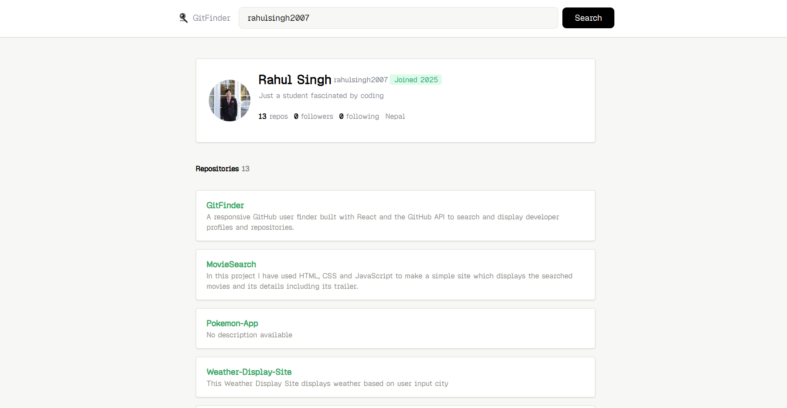
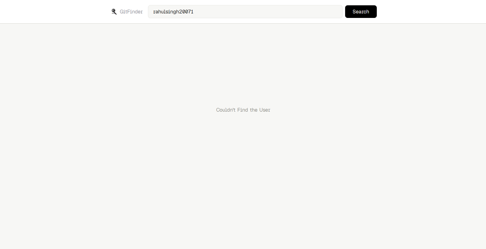

# GitFinder 🔍

> A clean, minimal GitHub user search app — find any GitHub profile and their repositories in seconds.

---

## About

**GitFinder** is a lightweight React web application that lets you explore any public GitHub account instantly. Enter a username, hit Search, and get a full snapshot of the user's profile along with their public repositories all pulled live from the GitHub REST API.
Whether you're vetting an open-source contributor, exploring a developer's work, or just curious about someone's GitHub GitFinder makes it effortless.

---

## 🌐 Live Demo

> 🔗 **[https://github.com/rahulsingh2007/GitFinder](https://github.com/rahulsingh2007/GitFinder)**

---

## 📸 Screenshots

### Initial UI — Landing State


### Searched UI — Profile & Repositories


### Error UI — User Not Found


---

## 🚀 Features

- 🔍 **Instant GitHub Search** — Search any public GitHub username in real time
- 👤 **Profile Overview** — Displays avatar, name, bio, followers, following, and public repo count
- 📦 **Repository Listing** — Shows all public repositories sorted by most recently updated
- 🔗 **Direct Repo Links** — Click any repository card to open it directly on GitHub
- ⚡ **Loading States** — Search button shows a "Searching…" indicator while fetching
- ❌ **Error Handling** — Friendly "Couldn't Find the User" message on invalid usernames
- 📱 **Responsive Layout** — Works cleanly on mobile, tablet, and desktop
- 🔄 **Logo Reset** — Click the GitFinder logo to reset and start a new search

---

## 🎨 Design System & Aesthetics

GitFinder uses a minimal, clean design language inspired by modern developer tools.

| Token | Value | Usage |
|---|---|---|
| Background | `#F7F7F5` | App background |
| Surface | `#FFFFFF` | Cards, Navbar |
| Border | `#E2E2DE` | Dividers, card edges |
| Muted Text | `#888882` | Secondary text, labels |
| Accent Green | `#2CA95B` | Repository name links |
| CTA / Button | `#000000` | Search button |
| Font Family | Geist Pixel (custom) | Global typeface |

**Design decisions:**
- Flat card surfaces with subtle `border` + `shadow-sm` — no heavy shadows or gradients
- Compact navbar that collapses gracefully on smaller screens
- Neutral palette keeps the focus on the GitHub data, not the chrome
- Active button scale (`active:scale-98`) gives tactile feedback

---

## 📁 Project Structure

```
GitFinder-App/
├── public/
│   ├── favicon.svg
│   └── icons.svg
├── src/
│   ├── assets/
│   │   ├── favicon.svg
│   │   ├── Intial-UI.png
│   │   ├── Searched-UI.png
│   │   └── Error-UI.png
│   ├── Components/
│   │   ├── Navbar.jsx          # Search bar + logo
│   │   ├── User.jsx            # Top-level user/error/empty state router
│   │   ├── Repo.jsx            # Repository card list
│   │   └── UserDetails/
│   │       ├── UserDetail.jsx  # Profile card wrapper
│   │       ├── Profile.jsx     # Name, username, stats
│   │       └── GitHubber.jsx   # GitHub-specific detail badges
│   ├── App.jsx                 # Root component + API logic
│   ├── index.css               # Global styles
│   └── main.jsx                # React DOM entry point
├── index.html
├── vite.config.js
├── package.json
└── README.md
```

---

## ⚙️ Tech Stack

| Technology | Version | Role |
|---|---|---|
| [React](https://react.dev) | 19 | UI framework |
| [Vite](https://vite.dev) | 8 | Build tool & dev server |
| [Tailwind CSS](https://tailwindcss.com) | 4 | Utility-first styling |
| [Axios](https://axios-http.com) | 1.x | HTTP client for GitHub API |
| [Lucide React](https://lucide.dev) | 1.x | Icon library |
| [GitHub REST API](https://docs.github.com/en/rest) | v3 | User & repository data |

---

## 🛠️ Installation & Setup

### Prerequisites

- **Node.js** v18 or higher
- **npm** v9 or higher

### Steps

```bash
# 1. Clone the repository
git clone https://github.com/rahulsingh2007/GitFinder.git

# 2. Navigate into the project directory
cd GitFinder

# 3. Install dependencies
npm install

# 4. Start the development server
npm run dev
```

The app will be available at **[http://localhost:5173](http://localhost:5173)**.

### Build for Production

```bash
npm run build
```

Output will be in the `dist/` folder, ready for static hosting (Vercel, Netlify, GitHub Pages, etc.).

---

## 📡 API Reference

GitFinder uses the **GitHub REST API v3** — no authentication or API key required for public data (rate limit: 60 requests/hour per IP).

### Get User Profile

```
GET https://api.github.com/users/{username}
```

**Key fields used:**

| Field | Description |
|---|---|
| `login` | GitHub username |
| `name` | Display name |
| `avatar_url` | Profile picture URL |
| `bio` | User bio |
| `public_repos` | Number of public repositories |
| `followers` | Follower count |
| `following` | Following count |

### Get User Repositories

```
GET https://api.github.com/users/{username}/repos?sort=updated
```

**Key fields used:**

| Field | Description |
|---|---|
| `id` | Unique repo ID (used as React key) |
| `name` | Repository name |
| `html_url` | Direct link to repo on GitHub |
| `description` | Short repository description |

> **Note:** The GitHub API returns up to 30 repositories per request by default. Pagination is not currently implemented.

---

## 📝 License

This project is open source and available under the [MIT License](https://opensource.org/licenses/MIT).

---

<div align="center">
  Built with ❤️ by <a href="https://github.com/rahulsingh2007">Rahul Singh</a>
</div>